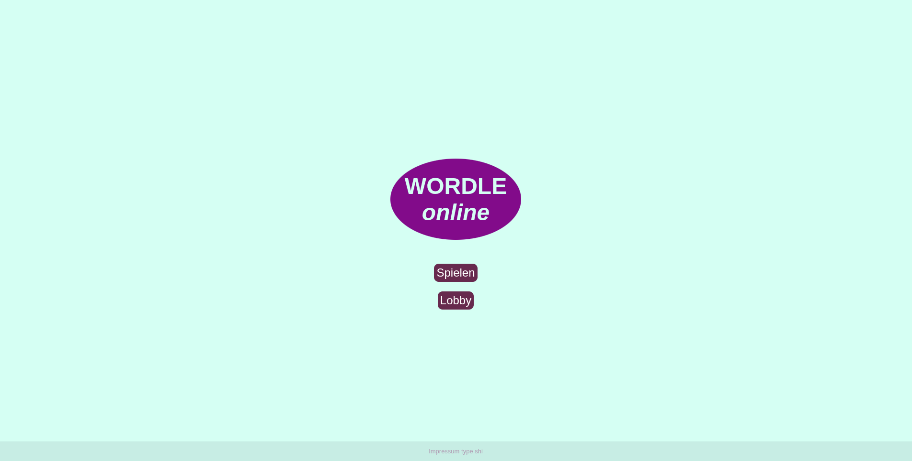
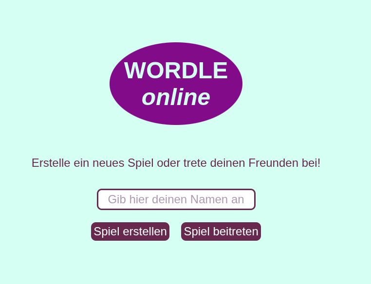
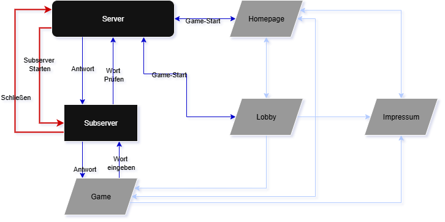
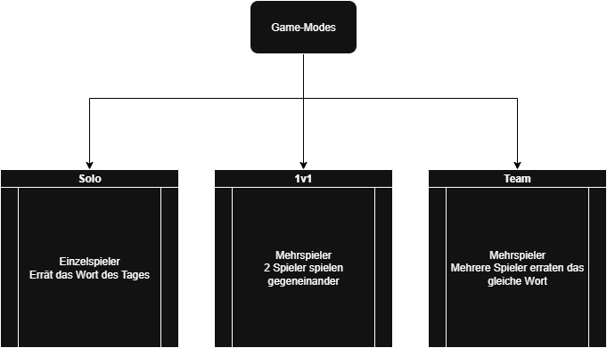

# Multiplayer Wordle
[](https://nodejs.org/)
[](https://spring.io/projects/spring-boot/)
[](https://socket.io/)
[](https://gradle.org/)
---


Willkommen bei Multiplayer Wordle! Dies ist eine unterhaltsame Echtzeit-Adaption des beliebten Worträtselspiels, das für dich und deine Freunde entwickelt wurde, um es gemeinsam zu genießen. Fordert euch gegenseitig heraus, das geheime Wort innerhalb einer begrenzten Anzahl von Versuchen zu erraten, mit Live-Updates über den Fortschritt jedes Spielers.


---

## Inhaltsverzeichnis
* [🎮 Gameplay](#Gameplay)
* [🛠️ Aufbau](#Aufbau)
* [📸 Screenshots](#Screenshots)
* [💥 Highlights](#Highlights)
* [💡 Funktionsweise](#Funktionsweise)
* [🚀 Schnelleinstieg](#Schnelleinstieg)
* [📝 Technische Dokumentation](#Technische-dokumentation)
* [🗂️ Projekt Aufbau](#Projekt-aufbau)

---
<a name="Gameplay"></a>
## 🎮 Gameplay

Multiplayer Wordle bringt das klassische Wortratespiel in eine dynamische Mehrspielerumgebung. Es gibt die möglichkeit das Tägliche Wort zu erraten was alle 24 Stunden sich ändert. Oder beim starten des spiels ein einzigartiges Wort zu haben. Beim erraten des Wortes werden die buchstaben in folgenden Farben angezeigt:

* 🟩 **Grün:** Der Buchstabe ist korrekt und an der richtigen Position.
* 🟨 **Gelb:** Der Buchstabe ist korrekt, aber an der falschen Position.
* ⬜ **Grau:** Der Buchstabe ist nicht im Wort enthalten.

Es gibt auch die Möglichkeit mit Freunden zu spielen. Miteinander oder Gegeneinander!
In dem "1v1" Modus spielt man gegen einen anderen Nutzer spielt. Der der als erstes das wort errät hat gewonnen.
Oder man spielt im "Team" modus miteinander um das wort zu erraten.

---
<a name="Aufbau"></a>
## 🛠️ Aufbau

Dieses Projekt ist in mehreren Schlüsselkomponenten organisiert:

* **Frontend:** Entwickelt mit vanilla HTML/CSS und Javascript für eine interaktive Benutzeroberfläche.
* **Backend:** Realisiert mit Java Spring boot (Kontroll Server) und NodeJS (Lobby Server) zur Verwaltung der Spiellogik, der Benutzerzustände und der Spieler logik.
* **WebSockets:** Verwendet SocketIO für die Echtzeitkommunikation zwischen Server und Clients, um ein nahtloses Multiplayer-Erlebnis zu gewährleisten.
* **"Datenbank":** Wir nutzen eine simple aber funktionale Text datei für die verfügbaren Wörter.

---
<a name="Screenshots"></a>
## 📸 Screenshots






---
<a name="Highlights"></a>
## 💥 Highlights

* **Mehrspieler Support** - Lobby bassierter Mehrspieler
* **Echtzeit Gameplay** - Versuche werden in echtzeit an Mitspieler weiter geleitet
* **Simples Design** - übersichtliches Design mit einfachen Farben und guter Lesbarkeit

---
<a name="Funktionsweise"></a>
## 💡 Funktionsweise

Das Spiel funktioniert wie folgt:

1.  **Spielerbeitritt:** Benutzer können über eine Spiel-ID einem Raum beitreten oder einen neuen erstellen. Andernseits kann auch eine Einzelspieler Lobby gestartet werden 
2.  **Wortauswahl:** Der Server wählt ein zufälliges fünfstelliges Wort aus den vorgegebenen Wörter. 
3.  **Raten:** Spieler geben ihre Vermutungen ein. Jede Vermutung wird an den Server gesendet, der sie validiert und das Ergebnis (grün/gelb/grau) an alle Spieler im Raum zurücksendet.
4.  **Echtzeit-Updates:** Dank SocketIO sehen alle Spieler in Echtzeit, welche Buchstaben die anderen Spieler bereits geraten haben und wie nahe sie der Lösung sind (ohne die genauen Wörter der anderen preiszugeben, es sei denn, sie wurden korrekt geraten).
5.  **Rundenende:** Die Runde endet, wenn ein Spieler das Wort errät oder alle Spieler ihre maximalen Versuche ausgeschöpft haben. Der Gewinner wird bekannt gegeben.

---
<a name="Schnelleinstieg"></a>
## 🚀 Schnelleinstieg

Um Multiplayer Wordle lokal einzurichten und zu starten:
1. **Repo Main branch clonen**
2. **In beliebiger IDE importieren**
3. **Start.java ausführen**
4. **Öffne deinen Browser und navigiere zu `http://localhost:8080`.**
5. **Hab Spaß!**

(Noch nicht 100% Funktionel){
1.  **Jar runterladen:**
    ```bash
    https://github.com/FizzHatMc/WebEngineeringWordle/releases
    ```
2.  **Ausführen mit Java 23 installiert:**
    ```bash
    path/to/java_Installation -jar /pfad/zu/date/wordle.jar
    ```
3.  **Öffne deinen Browser und navigiere zu `http://localhost:8080`.**
4.  **Hab Spaß!**
}

---
<a name="Technische-dokumentation"></a>
## 📝 Technische Dokumentation

### Aufbau der Server und Websiten

Die Homepage (home.html) ist die startseite, auf der das Impressum (impressum.html) ist und das Spiel gestartet werden kann. Es wird daraufhin entweder zur Lobby (lobby.html) weitergeleitet oder direkt in ein Spiel (game_.html / game_1v1.html). 
Wenn der Spieler auf der Lobby website ein Spiel startet, wird er darauf hin auch zu einem Game (game_.html / game_1v1.html) weitergeleitet.
Es kann von jeder Website (bis auf Homepage) auf die "Wordle Online" schrift gedrückt werden um auf die Homepage zurückzukommen.



### Spielmodis

Es existieren technisch 3 Modis. </br>
- **Solo** - Spieler spielt alleine und errät das tägliche Wort
- **1v1** - Zwei Spieler spielen gegeneinander. Der erste der das Tägliche oder sein eigenes Wort errät, gewinnt.
- **Team** - Zwei Spieler erraten das Tägliche oder Lobby Wort zusammen



### Seiten Aufbau

Alle Seiten haben ein Simples aber funktionales Design. Wir nutzen haben ein festes Impressum im "Fuß" der seite. 

---
<a name="Projekt-aufbau"></a>
## 🗂️ Projekt Aufbau
```
- Multiplayer Wordle
├── /PM
│   ├── AblaufplanFolie.pf
│   ...
├── /gradle
├── /src/main
        ├── /java/de/dhbwka/java/exercise/packages
        ├── /resources
            ├── images
            │   ├── Lobby.png
            │   ...
            ├──static
            │   ├── game.css
            │   ...
            ├──templates
            │   ├── game.html
            │   ...
```
---

## Projekt management

[Projekt Management Dokumentation](/pm/PM_merged.pdf)

---

## Zukunft des Projektes

* Design Überarbeitung (Modernisieren und verbessertes Mobile Design) möglicherweiße mit Framework
* Datenbank anbindung für die Wörter
* Live Hosten auf Server
* Lobby Anzeige um leicht beitreten zu können
* Spieler Chat
* Punkte system mit Schnellster / Bester spieler jemals (benötigt Live Hosting)
  

---
<a name="Team"></a>
## Das Team

Entwickelt von Jonas (Control Server), Jonathan (Front End), Kilian (Projektmanagement) und Marcel (Lobby Server)
